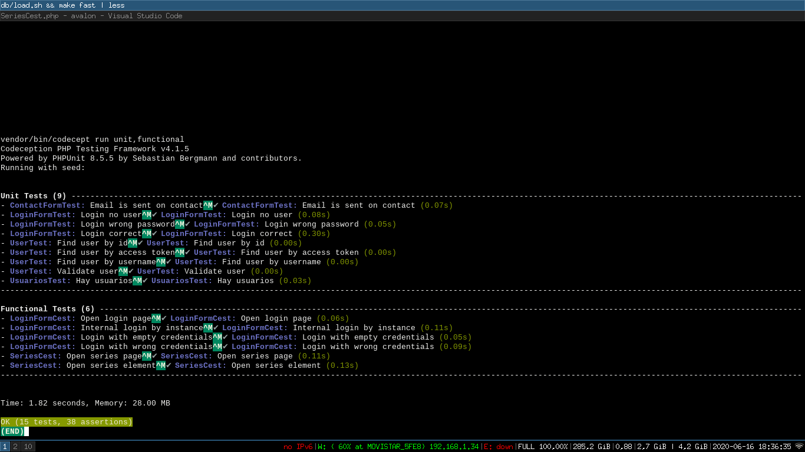

# Anexos

# Anexos

### **([R34](https://github.com/DiegoHildeirnk/avalon/issues/34)) Validación HTML5, CSS3 y accesibilidad**
---
### Validación de HTML y CSS

**HTML**

[Enlace a la validación HTML](https://validator.w3.org/nu/?doc=https%3A%2F%2Favlon.herokuapp.com%2F)

**CSS**

[Enlace a la validación CSS](https://jigsaw.w3.org/css-validator/validator?uri=https%3A%2F%2Favlon.herokuapp.com%2F&profile=css3svg&usermedium=all&warning=1&vextwarning=&lang=es)

---

### Validación de accesibilidad

[Enlace a la validación WCAG](https://achecker.ca/checker/index.php)

---

### Prueba del seis

 1. ¿Qué sitio es éste?
- La aplicación tiene en todo momento elementos indicativos de que sitio es. Arriba en la menú de navegación está en todo momento el logotipo de la aplicación. Abajo en el pié de página, esta también el nombre de la web. El menú de navegación y el pié de página se mantienen siempre, por lo que siempre está identificado el sitio.

 2. ¿En qué página estoy?
- La aplicación no posee migas de pan pero en todo momento es posible saber donde estás.

 3. ¿Cuales son las principales secciones del sitio?
- Las principales secciones del sitio son *Peliculas*, *Series*, *Libros*, *Lista* y *Perfil* (solo serán visibles si estamos logueados en la aplicación).

 4. ¿Qué opciones tengo en este nivel?
- Dentro de las secciones *Libros*, *Peliculas* y *Series* tienes para elegir en forma de menu desplegable las formas de ordenacion mas comunes. En *Social* tienes 2 opciones a elegir, *Valoraciones* y *Usuarios*.

 5. ¿Dónde estoy en el esquema de las cosas?
- En todas las páginas existe en la zona superior un indicador de bloque con las migas de pan.

 6. ¿Cómo busco algo?
- Cada seccion tiene su buscador especifico, excepto *Perfil* y *Home*.

---

### **([R36](https://github.com/DiegoHildeirnk/avalon/issues/36)) Varios navegadores**

#### **Google Chrome**

---

#### **Mozilla Firefox**

---

#### **Microsoft Edge**

---

### **([R25](https://github.com/FranBarGar/netflox/issues/25)) Codeception**

---

### **(RXX)) Tecnologias usadas**

- Raspberry pi 3 para iniciar el SO Ubuntu
- Rasbian como sistema operativo
- Heroku como alojamiento cloud
- Yii2 como framework
- GIT, GITHUB y GIT-FLOW para el control de versiones
- Git-Kraken como asistente grafico a GIT-FLOW
- Visual Studio Code como Editor de texto
- Google Chrome como navegador principal
- Dbdesigner como interfaz grafico SQL
- Umlet como editor de diagramas
- Codeception para las pruebas unitarias

---